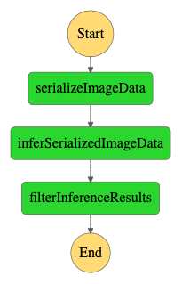
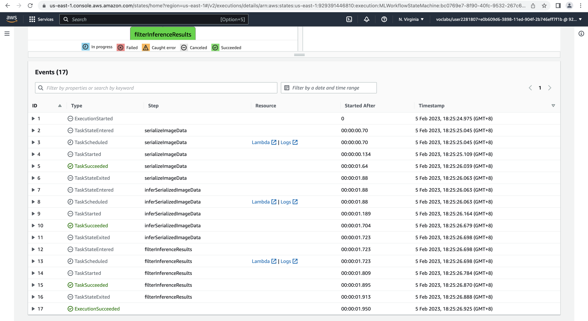

# Udacity-Developing-Your-First-ML-Workflow

## Deploy and monitor a machine learning workflow for Image Classification

### Dataset Prep 


### Training Job 


### Endpoint Deployment


### 3 Lambdas for to take s3 image object key, serialise the s3 image object, get inference result and filter lower threshold results

```Codes in lambda.py```

1 - serializeImageData - Added permission for S3 Full Access to read S3 image objects
2 - inferSerializedImageData - Added permission for Sagemaker Full Access to invoke sagermaker endpoint
3 - filterResults - No extra permissions required

### Step Function Graph



```State Machine config in MLWorkflowStateMachine.json```

### State Machine Execution - Success



### State Machine Execution - Failure (Exception for lower threshold)


### Data Capture for Multiple Inferences


### Visualisation Plot


## License

[License](LICENSE.txt)
